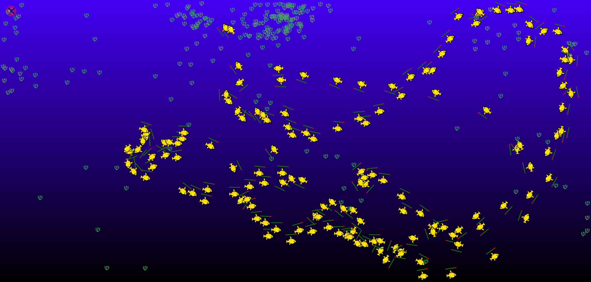

# Aquasterone
Simulation of aquatic inhabitants' behaviour.

## Rules
- Aquatic inhabitant ("Aquatic") has a value of "testosterone level".
- Every Aquatic, when created, choose its "favourite" leader, and follows him.
- Sometimes "testosterone level" may vary.

## Technologies
- Pure HTML/CSS/JS.
- requestAnimationFrame() is used.